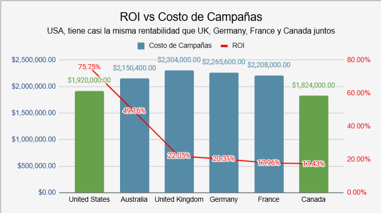
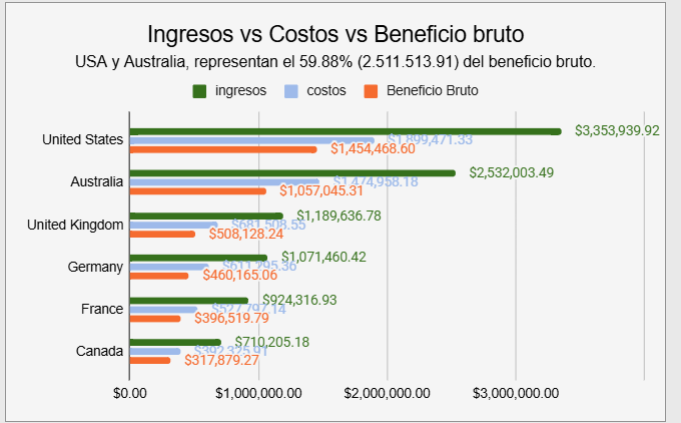

# 📈 AdventureWorks - Financial Performance & ROI Analysis
---
## 📌 Project Overview

This project analyzes AdventureWorks sales, products, territories, and marketing campaign data across five international markets to evaluate financial performance and marketing efficiency.

The objective was to identify high-performing markets, detect inefficiencies in advertising investments, and generate business recommendations to improve profitability and reduce market dependency.

---

## 🎯 Business Problem

Companies need to evaluate whether marketing investments are generating profitable returns across international markets.

The objective was to identify high-performing markets, detect inefficient marketing spend, and generate recommendations to improve profitability.

---

## 🛠️ Tools & Technologies

- SQL
- Google Sheets
- Data Cleaning
- Data Validation (QA)
- KPI Analysis
- ROI Analysis
- Dashboard Development
- Business Intelligence
- Executive Reporting
- Data Storytelling

---

## 🔄 Process

### 1. Data Extraction & Data Cleaning

- Navigated a relational database schema.
- Built SQL JOINs to combine multiple tables.
- Filtered and cleaned datasets.
- Handled NULL values.
- Standardized categories and data types.

### 2. Financial KPI Calculation

Calculated key business metrics, including:

- Revenue
- Costs
- Gross Profit
- Profit Margin
- Return on Investment (ROI)

### 3. Quality Assurance (QA)

Validated calculations by performing:

- Total revenue checks
- Profit validation
- Margin consistency verification

### 4. Data Visualization & Executive Reporting

Created dashboards and structured findings using the:

**Context → Finding → Implication (C → F → I)** framework.

---

## 🔑 Key Findings

### 🇺🇸 United States

- Highest revenue market: **$3.35M**
- Highest ROI: **75.75%**

### 🇨🇦 Canada

- Highest profit margin: **44.76%**
- Strong growth opportunity despite lower market share.

### 🇪🇺 European Markets

- Marketing inefficiencies detected.
- ROI ranged between **17% and 22%**.

### 📊 Market Concentration Risk

- USA and Australia generated **59.88% of total profits**, creating a dependency risk.

---

## 💡 Business Recommendations

- Redistribute marketing budgets toward higher-performing markets.
- Improve advertising efficiency in Europe.
- Increase investment in Canada due to its strong profitability.
- Diversify revenue streams to reduce dependency on USA and Australia.

---

## 🚀 Project Impact

- Analyzed financial performance across 5 international markets  
- Evaluated marketing ROI and profitability across global campaigns  
- Identified USA as the highest revenue market with $3.35M in sales  
- Detected low advertising efficiency in European markets with ROI between 17% and 22%  

---

## 📷 Dashboard

### ROI Analysis Dashboard



###  Financial Performance Dashboard



---

## 📂 Repository Structure

```
AdventureWorks-ROI-Analysis/
│
├── README.md
├── SQL_queries.sql
├── Dashboard.xlsx
└── images/
    ├── dashboard1.png
    └── dashboard2.png
```

---

## 👨‍💻 Author

**Danilo Gallego López**

Junior Data Analyst | Reporting | Business Intelligence | Sales Analytics

📧 danyd686@gmail.com

🔗 LinkedIn: www.linkedin.com/in/danilogallego

